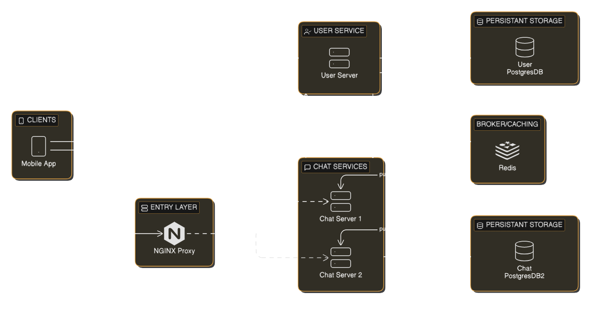

# Distributed Chat App

## Features:
- Real-time message delivery
- One-on-one and Group chats
- Chat initatiation through registrated phone number
- Create group conversations similar to WhatsApp
- Message history/persistence and offline viewing
- Typing indicators

## Technical Overview:  
- Supports running multiple instances of chatservice
- Redis pub/sub for broadcasting messages between server instances
- gRPC for communicating between chatservice and userservice
- Redis for caching gRPC responses
- Hive for caching API responses
- Both traditional registration/login and Google OAuth
- AES/GCM for message encryption
